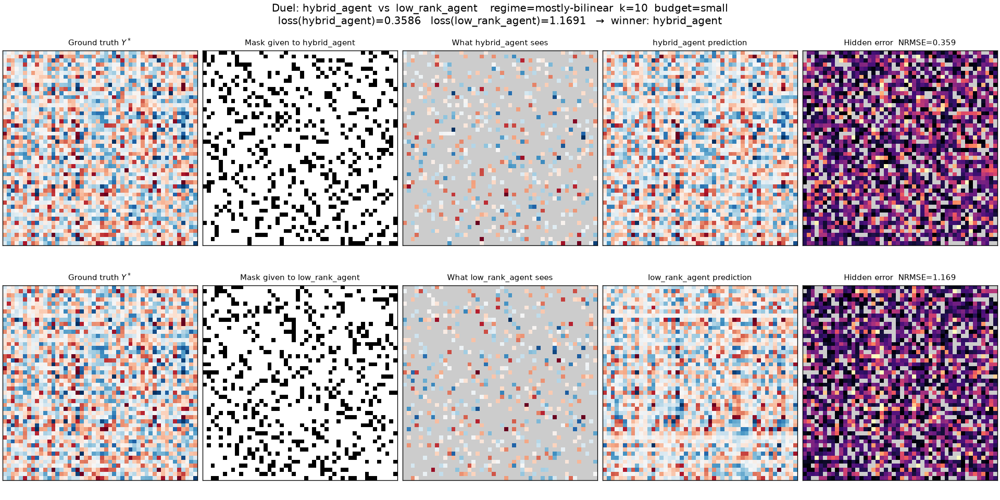
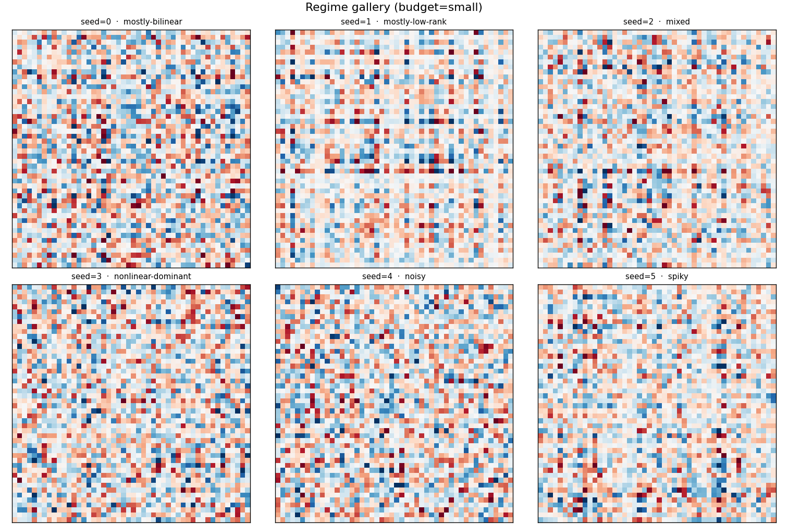
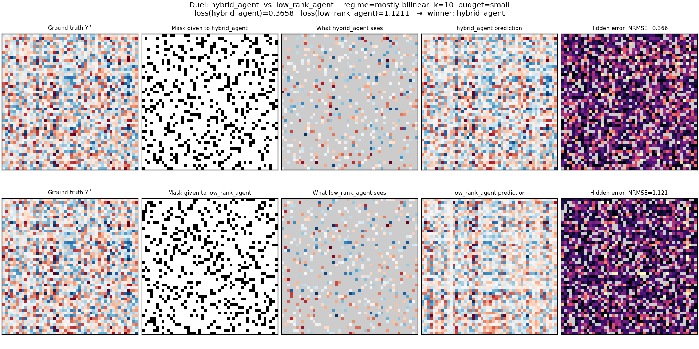

# Matrix Arena

**Adversarial inductive matrix completion — entrance test for the Armenian LLM Summer School 2026**


This repo is two things in one:

1. **A from-scratch, spec-faithful implementation** of the Matrix Arena competition environment — the instance generator, scoring, k-regular mask machinery, duel/tournament engine, Bradley–Terry ranking, and a match visualizer — built entirely from the [challenge statement](challenge_statement.pdf), with no access to the organizers' code.
2. **My competition entrant**, `ultimate_agent`, developed and stress-tested against that environment through ten iterations, plus the baselines it has to beat.



## Contents

- [The problem, in short](#the-problem-in-short)
- [What's in this repo](#whats-in-this-repo)
- [Results](#results)
- [The agent: `ultimate_agent`](#the-agent-ultimate_agent)
- [How I got here: agent evolution](#how-i-got-here-agent-evolution)
- [Quickstart](#quickstart)
- [Visual gallery](#visual-gallery)
- [Fair play, by construction](#fair-play-by-construction)
- [Repository structure](#repository-structure)
- [License](#license)

## The problem, in short

You're given row/column features `X`, `Z`, a partial view `Y_obs` of a hidden matrix `Y*`, and an observation mask `M`. `Y*` is generated from a hidden mixture of a **bilinear** term, a **low-rank latent** term, and a **weak nonlinear** term, then normalized.

- **Solve:** predict the entries hidden by `M`. Scored as `NRMSE` on hidden cells only, converted to a `solve_score` relative to the mean-fill baseline.
- **Attack:** without seeing `Y*`, design the k-regular connected mask your *opponent* receives before they solve. In a duel, both agents solve the **same** hidden matrix under masks chosen by the other.
- **Final score:** `0.60 · solve_score + 0.35 · Bradley-Terry Elo + 0.05 · robustness`, all min-max normalized across submitted agents.

Full formal spec: [`challenge_statement.pdf`](challenge_statement.pdf) / [`.tex`](challenge_statement.tex).

## What's in this repo

| Piece | Where | What it does |
|---|---|---|
| Core library | [`src/matrix_arena/`](src/matrix_arena) | instance generator, masks, scoring, seeds, tournament, ranking, visualizer (1.4k lines) |
| Reference baselines | [`baselines/`](baselines) | mean / ridge / low-rank / hybrid solvers + a random-attack agent |
| My agents | [`my_agents/`](my_agents) | 10 iterations, `my_agent` → `ultimate_agent` (submitted) |
| Tests | [`tests/`](tests) | 74 pytest cases covering the whole core library |
| Scripts | [`scripts/`](scripts) | public grader, full tournament runner, match visualizer |
| Examples | [`examples/`](examples) | agent template + pre-rendered visualizations |

## Results

**Solve-only** (`scripts/run_public_grader.py`, 15 seeds, small + medium budgets):

| rank | agent | mean solve score | mean NRMSE |
|---|---|---|---|
| 1 | `ultimate_agent` | **0.0805** | 0.3184 |
| 2 | `ultimate_plus_agent` | 0.0805 | 0.3184 |
| 3 | `v5_plus_agent` | 0.0803 | 0.3186 |
| 4 | `hybrid_agent` (baseline) | 0.0749 | 0.3232 |
| 5 | `mean_agent` (baseline) | 0.0000 | 0.3752 |
| 6 | `ridge_agent` (baseline) | -0.0059 | 0.3812 |
| 7 | `low_rank_agent` (baseline) | -0.0251 | 0.4098 |

**Full round-robin duel tournament** (`scripts/run_tournament.py`, 9 agents, small budget):

| rank | agent | BT Elo | arena pts | W–D–L |
|---|---|---|---|---|
| 1 | `ultimate_agent` | **1724.1** | 0.805 | 38–0–9 |
| 2 | `ultimate_plus_agent` | 1724.1 | 0.805 | 38–0–9 |
| 3 | `v5_plus_agent` | 1717.6 | 0.792 | 38–0–10 |
| 4 | `champion_agent` | 1613.6 | 0.625 | 30–0–18 |
| 5 | `power_agent` | 1573.0 | 0.562 | 27–0–21 |
| 6 | `hybrid_agent` | 1470.3 | 0.417 | 20–0–28 |
| 7 | `mean_agent` | 1347.6 | 0.266 | 12–1–34 |
| 8 | `ridge_agent` | 1180.5 | 0.125 | 6–0–42 |
| 9 | `low_rank_agent` | 1149.2 | 0.104 | 5–0–43 |

`ultimate_agent` ranks first in **both** the solve-only and duel settings across every baseline and every later agent I built — including `ultimate_plus_agent`, which adds an extra expert on top of it (see [below](#how-i-got-here-agent-evolution) for why that didn't help). A larger run is committed at [`leaderboard.csv`](leaderboard.csv).

Reproduce these exact tables:

```bash
python scripts/run_public_grader.py \
  --agents baselines/*.py my_agents/ultimate_agent.py my_agents/ultimate_plus_agent.py my_agents/v5_plus_agent.py \
  --seeds 15 --budgets small medium

python scripts/run_tournament.py \
  --agents baselines/*.py my_agents/*.py \
  --mode full --seeds 6 --budgets small
```

## The agent: `ultimate_agent`

**`solve()`** — a deadline-aware stacked ensemble of six experts, all fit under a wall-clock budget (55% of the timeout, with a graceful fallback at every stage):

1. **Bias** — additive row/column effects via median-polish sweeps.
2. **Bilinear** — closed-form ridge regression of `Y ≈ X W Zᵀ` on Kronecker features `xᵢ ⊗ zⱼ`.
3. **Robust bilinear** — the same fit re-weighted with Huber-IRLS, so a handful of high-magnitude ("spiky"-regime) observations can't dominate `W`.
4. **Low-rank** — vectorized ALS on the bilinear residual (`P Qᵀ`), padded/batched to handle ragged observation counts per row without a Python loop.
5. **Weak nonlinear** — ridge on random `tanh(xᵢ·pℓ · zⱼ·qℓ)` features, fit on what's left over.
6. **Mean** — the scoring baseline, included so the blend can fall back to it.

Hyperparameters (ridge `α`, ALS rank/`λ`, nonlinear `α`) are chosen by a quick single-split grid search, then all six experts are refit with **K-fold out-of-fold cross-validation** and blended by ridge-regressing the true observed values on the OOF predictions — so the ensemble weights are honest and can't overfit to data the experts have already memorized. The final grids are refit once more on *all* observed data using the learned weights, clipped to a safe range, and any NaN/Inf is sanitized before returning.

**`attack()`** — projects `X` and `Z` onto their top principal component (SVD), sorts rows/columns by that projection, and partitions both into matched clusters. Each cluster gets its own independent k-regular mask, with a single edge swap stitching consecutive clusters together for global connectivity. This concentrates the opponent's observations within feature-similar groups — the "low-leverage / clustered observation" tactic from the spec — while every output is self-validated (shape, degree, connectivity) with a certified from-scratch random-regular-mask fallback if anything is off or times out, so the attack can never draw the invalid-mask penalty by accident.

## How I got here: agent evolution

| Agent | Idea | Lines |
|---|---|---|
| `my_agent` → `my_agent_v4` | Single closed-form ridge/bilinear fits; progressively better defaults | ~200–300 |
| `my_agent_v5` | First 4-signal decomposition (bias + bilinear + ALS + weak nonlinear), blended via held-out validation | 570 |
| `power_agent` | Slimmer bilinear + low-rank-residual ensemble; attack sorts rows/columns by feature geometry into a banded mask | 177 |
| `v5_plus_agent` | `v5` architecture plus a pure direct-low-rank expert added to the blend | 601 |
| `champion_agent` | Adds its own from-scratch k-regular sampler + connectivity checker (self-contained, no grader dependency) | 385 |
| **`ultimate_agent`** ← *submitted* | Full stack: bias, bilinear, robust/Huber bilinear, ALS low-rank, weak nonlinear — blended with K-fold OOF stacking; SVD-clustered attack with certified fallback | 575 |
| `ultimate_plus_agent` | Combines `ultimate_agent`'s robust-bilinear expert with `v5_plus`'s direct-low-rank expert + a budget-adaptive attack | 680 |

The honest result: `ultimate_plus_agent` is *more* complex but doesn't beat `ultimate_agent` in either leaderboard above — it ties at best. The OOF-stacked blend in `ultimate_agent` already squeezes out most of the achievable gain; the extra expert in `ultimate_plus` adds redundancy rather than new signal. That's why `ultimate_agent`, not the "plus" version, is the one I submitted.

## Quickstart

```bash
# install (core is numpy-only; dev adds pytest+scipy, viz adds matplotlib)
pip install -e ".[dev]"
pip install -e ".[viz]"

# run the test suite (74 tests)
pytest tests/ -v

# solve-only public grader
python scripts/run_public_grader.py \
  --agents baselines/mean_agent.py my_agents/ultimate_agent.py \
  --seeds 10 --budgets small medium

# full duel tournament + Bradley-Terry ranking
python scripts/run_tournament.py \
  --agents baselines/*.py my_agents/*.py \
  --mode full --seeds 5 --output leaderboard.csv

# visualize a single reconstruction or a duel
python scripts/visualize_match.py solve --agent my_agents/ultimate_agent.py --seed 0 --budget small --output solve.png
python scripts/visualize_match.py duel  --agent-a my_agents/ultimate_agent.py --agent-b baselines/low_rank_agent.py --seed 0 --budget small --output duel.png
```

## Visual gallery

Each panel row reads left→right: hidden ground truth → observation mask → what the agent sees → prediction → hidden-cell error (the only thing that's scored).

**One ground-truth matrix per generative regime:**



**A duel — both agents solve the same hidden matrix under different opponent-chosen masks:**



More pre-rendered examples and the exact commands to regenerate them: [`examples/visualizations/`](examples/visualizations/README.md).

## Fair play, by construction

The `seed` passed to `solve`/`attack` is deliberately decoupled from the (private, high-entropy) generation seed — it exists only so an agent's own randomness is reproducible, and cannot be used to reconstruct `Y*`. No agent here reads the filesystem or shares state between calls; all masks are self-validated before being returned. See [`src/matrix_arena/seeds.py`](src/matrix_arena/seeds.py) and the *Fair play* section of the [challenge statement](challenge_statement.pdf) for the full constraint.

## Repository structure

```
matrix_arena/
├── src/matrix_arena/        core library: instance, masks, scoring, seeds, tournament, ranking, viz
├── baselines/               mean / ridge / low-rank / hybrid / random-attack reference agents
├── my_agents/                my_agent → ultimate_agent (submitted) → ultimate_plus_agent
├── examples/                 agent_template.py + pre-rendered visualizations
├── tests/                    74 pytest cases
├── scripts/                  run_public_grader.py, run_tournament.py, visualize_match.py
├── leaderboard.csv           a committed tournament run
└── challenge_statement.{pdf,tex}   full formal problem statement
```

## License

No license file is currently set — this repo defaults to "all rights reserved" until one is added. I'd suggest MIT if you want others to freely use/fork it.

---
*Built for the Armenian LLM Summer School 2026 entrance test. `ultimate_agent`'s code was written with help from Claude.*
